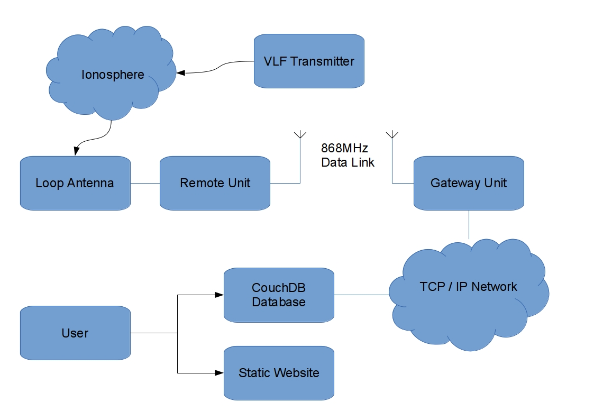

**Monitors VLF Radio Propagation in the Ionosphere**

This git repository is an overview of the project. This file contains
links to the actual sources.

## Block Diagram

## The Remote Unit

[Hardware Designs](https://github.com/richardeoin/vlf-remote-hardware)

[C Firmware](https://github.com/richardeoin/vlf-remote-firmware)

## The Gateway Uint

[Hardware Designs](https://github.com/richardeoin/vlf-gateway-hardware)

[C Firmware](https://github.com/richardeoin/vlf-gateway-firmware)

## The Website

Static HTML/CSS/Javascript + CouchDB

[NodeJS tool for configuring CouchDB](https://github.com/richardeoin/vlf-make-couchdb)

## Results

The plot below is a good example of the results that can be achived
when solar activity effects ionospheric propoagation. This plot is
from January when the short winter days here in the UK restricts the
hours when useful measurements can be obtained, but nevertheless this
plot shows the effect of several solar flares. The resulting peaks on
the graph have been labeled with the
[classification](http://spaceweather.com/glossary/flareclasses.html)
of the flare that caused them.

Below is another plot from quite a busy day during October. The usual
dawn/dusk and 07:00 UT transmitter shutdown patterns can be seen, but
the effects of two X-Class solar flares at 08:00 UT and 15:00 UT are
also visible.

## [License](LICENSE.md)

The majority of the project is under the
[MIT](http://opensource.org/licenses/MIT) license, but some parts are
not! Such as lwIP, which is under a BSD license.
